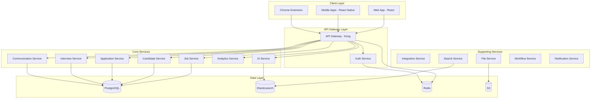
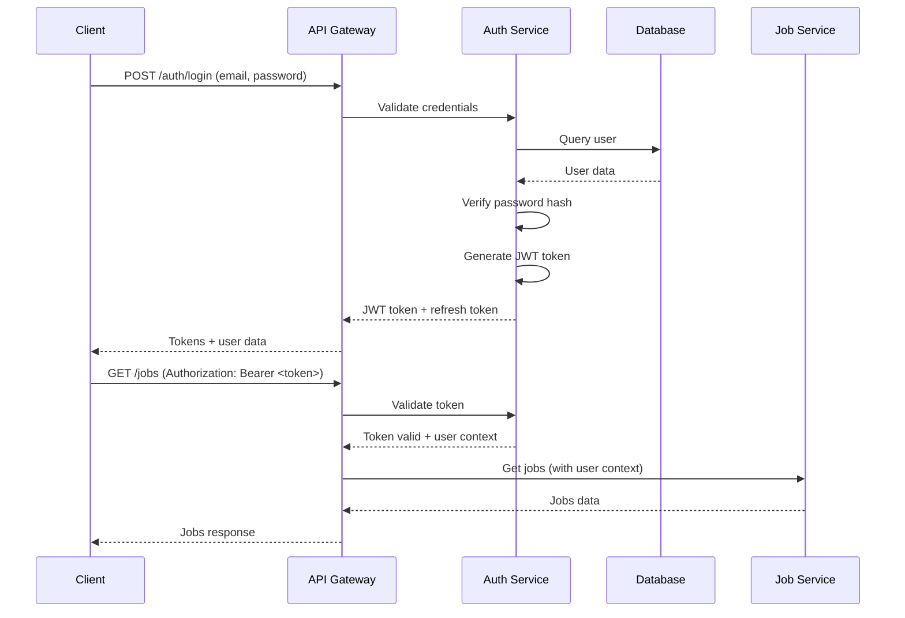

# Design Document

## Overview

This document outlines the technical design for an all-in-one recruiting platform that consolidates ATS, CRM, Interview Scheduling, and Advanced Analytics. The platform follows a microservices architecture with cloud-native deployment, AI-first capabilities, and enterprise-grade scalability.

### Design Principles

- **Unified Data Model**: Single source of truth with PostgreSQL as primary database
- **Microservices Architecture**: Loosely coupled services for scalability and maintainability
- **API-First Design**: RESTful and GraphQL APIs for all functionality
- **Real-Time Sync**: WebSocket connections for live updates
- **AI Integration**: ML models embedded throughout the platform
- **Security by Design**: Encryption, RBAC, and compliance built-in
- **Mobile-First**: Responsive web and native mobile apps

### Technology Stack

**Backend:**
- Language: Node.js with TypeScript (NestJS framework)
- API: RESTful + GraphQL
- Authentication: OAuth 2.0, JWT, SAML 2.0
- Task Queue: Bull with Redis
- Caching: Redis
- Search: Elasticsearch
- Real-time: Socket.io

**Frontend:**
- Framework: React 18 with TypeScript
- State Management: Zustand
- UI Library: Tailwind CSS + shadcn/ui
- Charts: Recharts
- Calendar: FullCalendar
- Rich Text: Tiptap

**Database:**
- Primary: PostgreSQL 15 with JSONB
- Search: Elasticsearch 8
- Cache: Redis 7
- Time-series: TimescaleDB extension

**AI/ML:**
- LLM: OpenAI GPT-4 for email generation, matching
- NLP: spaCy for resume parsing
- Vector DB: Pinecone for semantic search

**Infrastructure:**
- Cloud: AWS
- Containers: Docker
- Orchestration: Kubernetes (EKS)
- CI/CD: GitHub Actions
- Monitoring: Datadog
- Logging: ELK Stack
- Error Tracking: Sentry
- Storage: AWS S3
- CDN: CloudFront

## Architecture

### High-Level Architecture



### Microservices Architecture

**1. API Gateway Service**
- Request routing and load balancing
- Rate limiting (100 req/min standard, 200 burst)
- Authentication/authorization enforcement
- Request/response transformation
- API versioning

**2. Auth Service**
- User authentication (email/password, OAuth, SAML)
- JWT token generation and validation
- Multi-factor authentication
- Session management
- Permission evaluation

**3. Job Service**
- Job CRUD operations
- Job posting to external boards
- Job search and filtering
- Approval workflow management
- Job analytics

**4. Candidate Service**
- Candidate profile management
- Resume parsing and storage
- Duplicate detection and merging
- Candidate search (boolean, filters)
- Talent pool management

**5. Application Service**
- Application lifecycle management
- Pipeline stage transitions
- Application history tracking
- Bulk operations
- Stage analytics

**6. Interview Service**
- Interview scheduling
- Calendar integration (Google, Microsoft)
- Availability management
- Interview feedback collection
- Scorecard management

**7. Communication Service**
- Email sending/receiving (SMTP, IMAP)
- Email template management
- SMS messaging
- In-app notifications
- Communication history tracking

**8. Analytics Service**
- Metrics calculation and aggregation
- Dashboard data generation
- Custom report execution
- Data export (CSV, Excel, PDF)
- Scheduled report delivery

**9. AI Service**
- Resume parsing with NLP
- Candidate-job matching
- Email generation and personalization
- Interview transcript analysis
- Predictive analytics (time to fill, offer acceptance)

**10. Integration Service**
- HRIS integrations (BambooHR, Workday, etc.)
- Job board integrations (LinkedIn, Indeed, etc.)
- Calendar integrations (Google, Microsoft)
- E-signature integrations (DocuSign, HelloSign)
- Webhook management

**11. File Service**
- Resume upload and storage
- Document management
- File virus scanning
- CDN integration
- Access control

**12. Search Service**
- Full-text search across candidates, jobs
- Faceted search with filters
- Search result ranking
- Search analytics

**13. Workflow Service**
- Workflow definition and execution
- Event-driven triggers
- Condition evaluation
- Action execution (email, stage move, notifications)
- Workflow audit logging

**14. Notification Service**
- Real-time notifications via WebSocket
- Email notifications
- Slack/Teams integration
- Push notifications for mobile
- Notification preferences management

## Components and Interfaces

### Core Domain Models

**Organization**
```typescript
interface Organization {
  id: string;
  name: string;
  slug: string;
  settings: OrganizationSettings;
  createdAt: Date;
  updatedAt: Date;
}

interface OrganizationSettings {
  timezone: string;
  dateFormat: string;
  currency: string;
  features: string[];
  integrations: Record<string, any>;
}
```

**User**
```typescript
interface User {
  id: string;
  organizationId: string;
  email: string;
  firstName: string;
  lastName: string;
  role: UserRole;
  permissions: Permission[];
  avatarUrl?: string;
  timezone: string;
  locale: string;
  active: boolean;
  lastLogin?: Date;
  createdAt: Date;
}

enum UserRole {
  ADMIN = 'admin',
  RECRUITER = 'recruiter',
  HIRING_MANAGER = 'hiring_manager',
  INTERVIEWER = 'interviewer',
  COORDINATOR = 'coordinator',
  EXECUTIVE = 'executive'
}
```

**Job**
```typescript
interface Job {
  id: string;
  organizationId: string;
  title: string;
  description: string;
  departmentId: string;
  locationIds: string[];
  ownerId: string; // hiring manager
  status: JobStatus;
  employmentType: EmploymentType;
  remoteOk: boolean;
  salaryRange?: {
    min: number;
    max: number;
    currency: string;
  };
  requisitionId?: string;
  confidential: boolean;
  interviewPlanId?: string;
  customFields: Record<string, any>;
  createdAt: Date;
  updatedAt: Date;
  openedAt?: Date;
  closedAt?: Date;
}

enum JobStatus {
  DRAFT = 'draft',
  OPEN = 'open',
  ON_HOLD = 'on_hold',
  CLOSED = 'closed',
  CANCELLED = 'cancelled'
}

enum EmploymentType {
  FULL_TIME = 'full_time',
  PART_TIME = 'part_time',
  CONTRACT = 'contract',
  INTERNSHIP = 'internship'
}
```

**Candidate**
```typescript
interface Candidate {
  id: string;
  organizationId: string;
  email: string;
  firstName: string;
  lastName: string;
  phone?: string;
  location?: {
    city: string;
    state: string;
    country: string;
  };
  currentCompany?: string;
  currentTitle?: string;
  linkedinUrl?: string;
  githubUrl?: string;
  portfolioUrl?: string;
  resumeUrls: string[];
  tags: string[];
  source: {
    type: string;
    details: Record<string, any>;
  };
  gdprConsent: boolean;
  gdprConsentDate?: Date;
  customFields: Record<string, any>;
  createdAt: Date;
  updatedAt: Date;
}
```

**Application**
```typescript
interface Application {
  id: string;
  candidateId: string;
  jobId: string;
  stageId: string;
  status: ApplicationStatus;
  source: {
    type: string;
    details: Record<string, any>;
  };
  appliedAt: Date;
  stageEnteredAt: Date;
  rejectedAt?: Date;
  rejectionReasonId?: string;
  hiredAt?: Date;
  rating?: number; // 1-5
  archived: boolean;
  customFields: Record<string, any>;
  history: StageHistory[];
  createdAt: Date;
  updatedAt: Date;
}

enum ApplicationStatus {
  ACTIVE = 'active',
  REJECTED = 'rejected',
  WITHDRAWN = 'withdrawn',
  HIRED = 'hired'
}

interface StageHistory {
  fromStageId?: string;
  toStageId: string;
  movedAt: Date;
  movedBy: string;
  automated: boolean;
}
```

**Interview**
```typescript
interface Interview {
  id: string;
  applicationId: string;
  interviewStageId: string;
  scheduledAt: Date;
  durationMinutes: number;
  status: InterviewStatus;
  locationType: LocationType;
  locationDetails?: string;
  meetingLink?: string;
  roomId?: string;
  participants: InterviewParticipant[];
  feedback: InterviewFeedback[];
  createdAt: Date;
  updatedAt: Date;
}

enum InterviewStatus {
  SCHEDULED = 'scheduled',
  COMPLETED = 'completed',
  CANCELLED = 'cancelled',
  NO_SHOW = 'no_show'
}

enum LocationType {
  PHONE = 'phone',
  VIDEO = 'video',
  ONSITE = 'onsite'
}

interface InterviewParticipant {
  userId: string;
  role: 'interviewer' | 'coordinator' | 'observer';
  calendarEventId?: string;
}

interface InterviewFeedback {
  id: string;
  interviewId: string;
  interviewerId: string;
  scorecardId: string;
  overallRating: number; // 1-5
  decision: Decision;
  attributeRatings: AttributeRating[];
  strengths: string;
  concerns: string;
  notes?: string;
  submittedAt?: Date;
  createdAt: Date;
}

enum Decision {
  STRONG_YES = 'strong_yes',
  YES = 'yes',
  NEUTRAL = 'neutral',
  NO = 'no',
  STRONG_NO = 'strong_no'
}
```

### API Design

**RESTful API Endpoints**

Base URL: `https://api.platform.com/v1`

**Authentication:**
- All requests require `Authorization: Bearer <token>` header
- Tokens obtained via `/auth/login` or OAuth flow

**Jobs API:**
```
GET    /jobs                    # List jobs with filters
POST   /jobs                    # Create job
GET    /jobs/:id                # Get job details
PUT    /jobs/:id                # Update job
DELETE /jobs/:id                # Delete job
POST   /jobs/:id/publish        # Publish to job boards
GET    /jobs/:id/applications   # Get applications for job
GET    /jobs/:id/analytics      # Get job analytics
```

**Candidates API:**
```
GET    /candidates              # List candidates with search
POST   /candidates              # Create candidate
GET    /candidates/:id          # Get candidate details
PUT    /candidates/:id          # Update candidate
DELETE /candidates/:id          # Delete candidate (GDPR)
POST   /candidates/:id/merge    # Merge duplicate candidates
GET    /candidates/:id/applications  # Get candidate applications
```

**Applications API:**
```
GET    /applications            # List applications with filters
POST   /applications            # Create application
GET    /applications/:id        # Get application details
PUT    /applications/:id        # Update application
POST   /applications/:id/move   # Move to different stage
POST   /applications/:id/reject # Reject application
POST   /applications/:id/hire   # Mark as hired
```

**Interviews API:**
```
GET    /interviews              # List interviews
POST   /interviews              # Schedule interview
GET    /interviews/:id          # Get interview details
PUT    /interviews/:id          # Update interview
DELETE /interviews/:id          # Cancel interview
POST   /interviews/:id/feedback # Submit feedback
GET    /interviews/:id/feedback # Get all feedback
```

**Analytics API:**
```
GET    /analytics/metrics       # Get metric values
POST   /analytics/reports       # Generate custom report
GET    /analytics/dashboards    # List dashboards
POST   /analytics/dashboards    # Create dashboard
GET    /analytics/dashboards/:id # Get dashboard
```

**GraphQL API**

Endpoint: `https://api.platform.com/graphql`

**Example Queries:**
```graphql
query GetJobWithApplications($jobId: ID!) {
  job(id: $jobId) {
    id
    title
    status
    applications {
      id
      candidate {
        id
        firstName
        lastName
        email
      }
      stage {
        id
        name
      }
      rating
      appliedAt
    }
  }
}
```

```graphql
mutation MoveApplication($applicationId: ID!, $stageId: ID!) {
  moveApplication(applicationId: $applicationId, stageId: $stageId) {
    id
    stage {
      id
      name
    }
    stageEnteredAt
  }
}
```

**WebSocket Events**

Connection: `wss://api.platform.com/ws`

**Client → Server:**
```json
{
  "type": "subscribe",
  "channel": "applications",
  "filters": {
    "jobId": "uuid"
  }
}
```

**Server → Client:**
```json
{
  "type": "application.stage_changed",
  "data": {
    "applicationId": "uuid",
    "candidateId": "uuid",
    "jobId": "uuid",
    "fromStage": "phone_screen",
    "toStage": "technical_interview",
    "movedBy": "user_uuid",
    "timestamp": "2025-11-15T10:30:00Z"
  }
}
```

## Data Models

### Database Schema

**Core Tables:**

**organizations**
```sql
CREATE TABLE organizations (
  id UUID PRIMARY KEY DEFAULT gen_random_uuid(),
  name VARCHAR(255) NOT NULL,
  slug VARCHAR(100) UNIQUE NOT NULL,
  settings JSONB DEFAULT '{}',
  created_at TIMESTAMP DEFAULT NOW(),
  updated_at TIMESTAMP DEFAULT NOW()
);

CREATE INDEX idx_organizations_slug ON organizations(slug);
```

**users**
```sql
CREATE TABLE users (
  id UUID PRIMARY KEY DEFAULT gen_random_uuid(),
  organization_id UUID NOT NULL REFERENCES organizations(id) ON DELETE CASCADE,
  email VARCHAR(255) NOT NULL,
  password_hash VARCHAR(255),
  first_name VARCHAR(100),
  last_name VARCHAR(100),
  role VARCHAR(50) NOT NULL,
  permissions JSONB DEFAULT '[]',
  avatar_url TEXT,
  timezone VARCHAR(50) DEFAULT 'UTC',
  locale VARCHAR(10) DEFAULT 'en',
  active BOOLEAN DEFAULT TRUE,
  last_login TIMESTAMP,
  created_at TIMESTAMP DEFAULT NOW(),
  updated_at TIMESTAMP DEFAULT NOW(),
  UNIQUE(organization_id, email)
);

CREATE INDEX idx_users_org ON users(organization_id);
CREATE INDEX idx_users_email ON users(email);
```

**departments**
```sql
CREATE TABLE departments (
  id UUID PRIMARY KEY DEFAULT gen_random_uuid(),
  organization_id UUID NOT NULL REFERENCES organizations(id) ON DELETE CASCADE,
  name VARCHAR(255) NOT NULL,
  parent_id UUID REFERENCES departments(id),
  created_at TIMESTAMP DEFAULT NOW(),
  updated_at TIMESTAMP DEFAULT NOW()
);

CREATE INDEX idx_departments_org ON departments(organization_id);
```

**locations**
```sql
CREATE TABLE locations (
  id UUID PRIMARY KEY DEFAULT gen_random_uuid(),
  organization_id UUID NOT NULL REFERENCES organizations(id) ON DELETE CASCADE,
  name VARCHAR(255) NOT NULL,
  city VARCHAR(100),
  state VARCHAR(100),
  country VARCHAR(100),
  remote BOOLEAN DEFAULT FALSE,
  created_at TIMESTAMP DEFAULT NOW()
);
```

**jobs**
```sql
CREATE TABLE jobs (
  id UUID PRIMARY KEY DEFAULT gen_random_uuid(),
  organization_id UUID NOT NULL REFERENCES organizations(id) ON DELETE CASCADE,
  title VARCHAR(255) NOT NULL,
  description TEXT,
  department_id UUID REFERENCES departments(id),
  owner_id UUID REFERENCES users(id),
  status VARCHAR(50) NOT NULL DEFAULT 'draft',
  employment_type VARCHAR(50),
  remote_ok BOOLEAN DEFAULT FALSE,
  salary_min DECIMAL(12,2),
  salary_max DECIMAL(12,2),
  salary_currency VARCHAR(3) DEFAULT 'USD',
  requisition_id VARCHAR(100),
  confidential BOOLEAN DEFAULT FALSE,
  interview_plan_id UUID,
  custom_fields JSONB DEFAULT '{}',
  created_at TIMESTAMP DEFAULT NOW(),
  updated_at TIMESTAMP DEFAULT NOW(),
  opened_at TIMESTAMP,
  closed_at TIMESTAMP
);

CREATE INDEX idx_jobs_org ON jobs(organization_id);
CREATE INDEX idx_jobs_status ON jobs(status);
CREATE INDEX idx_jobs_department ON jobs(department_id);
```

**job_locations**
```sql
CREATE TABLE job_locations (
  job_id UUID REFERENCES jobs(id) ON DELETE CASCADE,
  location_id UUID REFERENCES locations(id) ON DELETE CASCADE,
  PRIMARY KEY (job_id, location_id)
);
```

**candidates**
```sql
CREATE TABLE candidates (
  id UUID PRIMARY KEY DEFAULT gen_random_uuid(),
  organization_id UUID NOT NULL REFERENCES organizations(id) ON DELETE CASCADE,
  email VARCHAR(255) NOT NULL,
  first_name VARCHAR(100),
  last_name VARCHAR(100),
  phone VARCHAR(50),
  location_city VARCHAR(100),
  location_state VARCHAR(100),
  location_country VARCHAR(100),
  current_company VARCHAR(255),
  current_title VARCHAR(255),
  linkedin_url TEXT,
  github_url TEXT,
  portfolio_url TEXT,
  tags TEXT[] DEFAULT '{}',
  source_type VARCHAR(50),
  source_details JSONB DEFAULT '{}',
  gdpr_consent BOOLEAN DEFAULT FALSE,
  gdpr_consent_date TIMESTAMP,
  custom_fields JSONB DEFAULT '{}',
  created_at TIMESTAMP DEFAULT NOW(),
  updated_at TIMESTAMP DEFAULT NOW(),
  UNIQUE(organization_id, email)
);

CREATE INDEX idx_candidates_org ON candidates(organization_id);
CREATE INDEX idx_candidates_email ON candidates(email);
CREATE INDEX idx_candidates_tags ON candidates USING GIN(tags);
```

**pipeline_stages**
```sql
CREATE TABLE pipeline_stages (
  id UUID PRIMARY KEY DEFAULT gen_random_uuid(),
  organization_id UUID NOT NULL REFERENCES organizations(id) ON DELETE CASCADE,
  name VARCHAR(100) NOT NULL,
  type VARCHAR(50) NOT NULL,
  order_index INTEGER NOT NULL,
  job_id UUID REFERENCES jobs(id) ON DELETE CASCADE,
  created_at TIMESTAMP DEFAULT NOW()
);

CREATE INDEX idx_stages_org ON pipeline_stages(organization_id);
CREATE INDEX idx_stages_job ON pipeline_stages(job_id);
```

**applications**
```sql
CREATE TABLE applications (
  id UUID PRIMARY KEY DEFAULT gen_random_uuid(),
  candidate_id UUID NOT NULL REFERENCES candidates(id) ON DELETE CASCADE,
  job_id UUID NOT NULL REFERENCES jobs(id) ON DELETE CASCADE,
  stage_id UUID NOT NULL REFERENCES pipeline_stages(id),
  status VARCHAR(50) NOT NULL DEFAULT 'active',
  source_type VARCHAR(50),
  source_details JSONB DEFAULT '{}',
  applied_at TIMESTAMP DEFAULT NOW(),
  stage_entered_at TIMESTAMP DEFAULT NOW(),
  rejected_at TIMESTAMP,
  rejection_reason_id UUID,
  hired_at TIMESTAMP,
  rating INTEGER CHECK (rating >= 1 AND rating <= 5),
  archived BOOLEAN DEFAULT FALSE,
  custom_fields JSONB DEFAULT '{}',
  created_at TIMESTAMP DEFAULT NOW(),
  updated_at TIMESTAMP DEFAULT NOW()
);

CREATE INDEX idx_applications_candidate ON applications(candidate_id);
CREATE INDEX idx_applications_job ON applications(job_id);
CREATE INDEX idx_applications_stage ON applications(stage_id);
CREATE INDEX idx_applications_status ON applications(status);
```

**application_history**
```sql
CREATE TABLE application_history (
  id UUID PRIMARY KEY DEFAULT gen_random_uuid(),
  application_id UUID NOT NULL REFERENCES applications(id) ON DELETE CASCADE,
  from_stage_id UUID REFERENCES pipeline_stages(id),
  to_stage_id UUID NOT NULL REFERENCES pipeline_stages(id),
  user_id UUID REFERENCES users(id),
  automated BOOLEAN DEFAULT FALSE,
  timestamp TIMESTAMP DEFAULT NOW()
);

CREATE INDEX idx_app_history_application ON application_history(application_id);
```

**interview_plans**
```sql
CREATE TABLE interview_plans (
  id UUID PRIMARY KEY DEFAULT gen_random_uuid(),
  organization_id UUID NOT NULL REFERENCES organizations(id) ON DELETE CASCADE,
  name VARCHAR(255) NOT NULL,
  job_id UUID REFERENCES jobs(id) ON DELETE CASCADE,
  created_at TIMESTAMP DEFAULT NOW()
);
```

**interview_stages**
```sql
CREATE TABLE interview_stages (
  id UUID PRIMARY KEY DEFAULT gen_random_uuid(),
  interview_plan_id UUID NOT NULL REFERENCES interview_plans(id) ON DELETE CASCADE,
  name VARCHAR(255) NOT NULL,
  type VARCHAR(50) NOT NULL,
  duration_minutes INTEGER NOT NULL,
  order_index INTEGER NOT NULL,
  instructions TEXT,
  scorecard_id UUID,
  created_at TIMESTAMP DEFAULT NOW()
);
```

**interviews**
```sql
CREATE TABLE interviews (
  id UUID PRIMARY KEY DEFAULT gen_random_uuid(),
  application_id UUID NOT NULL REFERENCES applications(id) ON DELETE CASCADE,
  interview_stage_id UUID REFERENCES interview_stages(id),
  scheduled_at TIMESTAMP NOT NULL,
  duration_minutes INTEGER NOT NULL,
  status VARCHAR(50) NOT NULL DEFAULT 'scheduled',
  location_type VARCHAR(50),
  location_details TEXT,
  meeting_link TEXT,
  room_id UUID,
  created_at TIMESTAMP DEFAULT NOW(),
  updated_at TIMESTAMP DEFAULT NOW()
);

CREATE INDEX idx_interviews_application ON interviews(application_id);
CREATE INDEX idx_interviews_scheduled ON interviews(scheduled_at);
```

**interview_participants**
```sql
CREATE TABLE interview_participants (
  interview_id UUID REFERENCES interviews(id) ON DELETE CASCADE,
  user_id UUID REFERENCES users(id) ON DELETE CASCADE,
  role VARCHAR(50) NOT NULL,
  calendar_event_id VARCHAR(255),
  PRIMARY KEY (interview_id, user_id)
);
```

**scorecards**
```sql
CREATE TABLE scorecards (
  id UUID PRIMARY KEY DEFAULT gen_random_uuid(),
  organization_id UUID NOT NULL REFERENCES organizations(id) ON DELETE CASCADE,
  name VARCHAR(255) NOT NULL,
  attributes JSONB NOT NULL,
  created_at TIMESTAMP DEFAULT NOW()
);
```

**interview_feedback**
```sql
CREATE TABLE interview_feedback (
  id UUID PRIMARY KEY DEFAULT gen_random_uuid(),
  interview_id UUID NOT NULL REFERENCES interviews(id) ON DELETE CASCADE,
  interviewer_id UUID NOT NULL REFERENCES users(id),
  scorecard_id UUID REFERENCES scorecards(id),
  overall_rating INTEGER CHECK (overall_rating >= 1 AND overall_rating <= 5),
  decision VARCHAR(50),
  attribute_ratings JSONB DEFAULT '[]',
  strengths TEXT,
  concerns TEXT,
  notes TEXT,
  submitted_at TIMESTAMP,
  created_at TIMESTAMP DEFAULT NOW()
);

CREATE INDEX idx_feedback_interview ON interview_feedback(interview_id);
CREATE INDEX idx_feedback_interviewer ON interview_feedback(interviewer_id);
```

**email_templates**
```sql
CREATE TABLE email_templates (
  id UUID PRIMARY KEY DEFAULT gen_random_uuid(),
  organization_id UUID NOT NULL REFERENCES organizations(id) ON DELETE CASCADE,
  name VARCHAR(255) NOT NULL,
  subject VARCHAR(500) NOT NULL,
  body TEXT NOT NULL,
  category VARCHAR(50),
  variables TEXT[] DEFAULT '{}',
  shared BOOLEAN DEFAULT FALSE,
  created_by UUID REFERENCES users(id),
  created_at TIMESTAMP DEFAULT NOW()
);
```

**communications**
```sql
CREATE TABLE communications (
  id UUID PRIMARY KEY DEFAULT gen_random_uuid(),
  candidate_id UUID REFERENCES candidates(id) ON DELETE CASCADE,
  application_id UUID REFERENCES applications(id) ON DELETE CASCADE,
  type VARCHAR(50) NOT NULL,
  direction VARCHAR(50) NOT NULL,
  from_email VARCHAR(255),
  to_emails TEXT[] NOT NULL,
  cc_emails TEXT[] DEFAULT '{}',
  subject VARCHAR(500),
  body TEXT,
  template_id UUID REFERENCES email_templates(id),
  status VARCHAR(50) NOT NULL DEFAULT 'draft',
  sent_at TIMESTAMP,
  opened_at TIMESTAMP,
  clicked_at TIMESTAMP,
  user_id UUID REFERENCES users(id),
  created_at TIMESTAMP DEFAULT NOW()
);

CREATE INDEX idx_communications_candidate ON communications(candidate_id);
CREATE INDEX idx_communications_application ON communications(application_id);
```

**offers**
```sql
CREATE TABLE offers (
  id UUID PRIMARY KEY DEFAULT gen_random_uuid(),
  application_id UUID NOT NULL REFERENCES applications(id) ON DELETE CASCADE,
  template_id UUID,
  status VARCHAR(50) NOT NULL DEFAULT 'draft',
  salary DECIMAL(12,2),
  currency VARCHAR(3) DEFAULT 'USD',
  bonus DECIMAL(12,2),
  equity JSONB,
  start_date DATE,
  sent_at TIMESTAMP,
  expires_at TIMESTAMP,
  accepted_at TIMESTAMP,
  declined_at TIMESTAMP,
  custom_fields JSONB DEFAULT '{}',
  created_at TIMESTAMP DEFAULT NOW(),
  updated_at TIMESTAMP DEFAULT NOW()
);

CREATE INDEX idx_offers_application ON offers(application_id);
CREATE INDEX idx_offers_status ON offers(status);
```

**talent_pools**
```sql
CREATE TABLE talent_pools (
  id UUID PRIMARY KEY DEFAULT gen_random_uuid(),
  organization_id UUID NOT NULL REFERENCES organizations(id) ON DELETE CASCADE,
  name VARCHAR(255) NOT NULL,
  description TEXT,
  type VARCHAR(50) NOT NULL,
  criteria JSONB,
  owner_id UUID REFERENCES users(id),
  tags TEXT[] DEFAULT '{}',
  created_at TIMESTAMP DEFAULT NOW(),
  updated_at TIMESTAMP DEFAULT NOW()
);
```

**talent_pool_members**
```sql
CREATE TABLE talent_pool_members (
  pool_id UUID REFERENCES talent_pools(id) ON DELETE CASCADE,
  candidate_id UUID REFERENCES candidates(id) ON DELETE CASCADE,
  added_at TIMESTAMP DEFAULT NOW(),
  PRIMARY KEY (pool_id, candidate_id)
);
```

### Elasticsearch Indices

**candidates_index**
```json
{
  "mappings": {
    "properties": {
      "id": { "type": "keyword" },
      "organizationId": { "type": "keyword" },
      "firstName": { "type": "text" },
      "lastName": { "type": "text" },
      "email": { "type": "keyword" },
      "currentTitle": { "type": "text" },
      "currentCompany": { "type": "text" },
      "skills": { "type": "text" },
      "tags": { "type": "keyword" },
      "location": {
        "properties": {
          "city": { "type": "text" },
          "state": { "type": "keyword" },
          "country": { "type": "keyword" }
        }
      },
      "resumeText": { "type": "text" },
      "createdAt": { "type": "date" }
    }
  }
}
```

## Error Handling

### Error Response Format

All API errors follow a consistent format:

```json
{
  "error": {
    "code": "VALIDATION_ERROR",
    "message": "Invalid input data",
    "details": [
      {
        "field": "email",
        "message": "Email is required"
      }
    ],
    "requestId": "req_abc123",
    "timestamp": "2025-11-15T10:30:00Z"
  }
}
```

### Error Codes

**Client Errors (4xx):**
- `VALIDATION_ERROR` (400): Invalid input data
- `UNAUTHORIZED` (401): Authentication required
- `FORBIDDEN` (403): Insufficient permissions
- `NOT_FOUND` (404): Resource not found
- `CONFLICT` (409): Resource conflict (e.g., duplicate email)
- `RATE_LIMIT_EXCEEDED` (429): Too many requests

**Server Errors (5xx):**
- `INTERNAL_ERROR` (500): Unexpected server error
- `SERVICE_UNAVAILABLE` (503): Service temporarily unavailable
- `GATEWAY_TIMEOUT` (504): Upstream service timeout

### Error Handling Strategy

**Backend:**
- Global exception handler in API Gateway
- Service-specific error handlers
- Structured logging with correlation IDs
- Error monitoring with Sentry
- Automatic retry for transient failures

**Frontend:**
- Global error boundary for React components
- Toast notifications for user-facing errors
- Automatic retry for network failures
- Offline mode with queue for failed requests
- Error reporting to backend

### Validation

**Input Validation:**
- Schema validation using Joi/Zod
- Email format validation
- Phone number format validation
- URL validation
- File type and size validation
- SQL injection prevention
- XSS prevention

**Business Logic Validation:**
- Duplicate candidate detection
- Stage transition rules
- Permission checks
- SLA threshold validation
- Date range validation

## Testing Strategy

### Unit Testing

**Backend:**
- Framework: Jest
- Coverage target: 80%+
- Test all service methods
- Mock external dependencies
- Test error handling

**Frontend:**
- Framework: Jest + React Testing Library
- Coverage target: 70%+
- Test component rendering
- Test user interactions
- Test state management

### Integration Testing

**API Testing:**
- Framework: Supertest
- Test all API endpoints
- Test authentication/authorization
- Test database operations
- Test external integrations

**Database Testing:**
- Use test database
- Transaction rollback after each test
- Test migrations
- Test constraints and indexes

### End-to-End Testing

**Framework:** Playwright

**Test Scenarios:**
- User registration and login
- Job creation and publishing
- Candidate application flow
- Interview scheduling
- Offer creation and acceptance
- Analytics dashboard viewing

### Performance Testing

**Load Testing:**
- Tool: k6
- Test concurrent users (1K, 5K, 10K)
- Test API response times
- Test database query performance
- Identify bottlenecks

**Stress Testing:**
- Test system limits
- Test recovery from failures
- Test auto-scaling

### Security Testing

**Automated:**
- OWASP ZAP for vulnerability scanning
- Dependency scanning (npm audit, Snyk)
- Static code analysis (SonarQube)

**Manual:**
- Penetration testing (annual)
- Security code review
- Authentication/authorization testing

## AI/ML Implementation Details

### Resume Parsing Pipeline

**Architecture:**
```
Resume Upload → S3 Storage → Lambda Trigger → Parsing Service → Database Update → Elasticsearch Index
```

**Implementation:**
1. **Text Extraction:**
   - PDF: pdfplumber or PyPDF2
   - DOC/DOCX: python-docx
   - OCR for scanned documents: Tesseract

2. **NLP Processing:**
   - Library: spaCy with custom trained model
   - Named Entity Recognition for:
     - Person names (PERSON)
     - Organizations (ORG)
     - Dates (DATE)
     - Locations (GPE)
     - Skills (custom entity)

3. **Structured Data Extraction:**
   - Regex patterns for email, phone, URLs
   - Section detection (Experience, Education, Skills)
   - Date parsing and normalization
   - Skills extraction using taxonomy

4. **Confidence Scoring:**
   - Field-level confidence scores
   - Overall parsing quality score
   - Manual review flag for low confidence

### Candidate Matching Algorithm

**Scoring Components:**

```typescript
interface MatchScore {
  overall: number; // 0-100
  breakdown: {
    skills: number;
    experience: number;
    education: number;
    location: number;
    title: number;
  };
  skillGaps: string[];
  matchReasons: string[];
}

function calculateMatchScore(
  candidate: Candidate,
  job: Job
): MatchScore {
  const weights = {
    skills: 0.40,
    experience: 0.25,
    education: 0.15,
    location: 0.10,
    title: 0.10
  };
  
  const scores = {
    skills: calculateSkillMatch(candidate, job),
    experience: calculateExperienceMatch(candidate, job),
    education: calculateEducationMatch(candidate, job),
    location: calculateLocationMatch(candidate, job),
    title: calculateTitleMatch(candidate, job)
  };
  
  const overall = Object.entries(scores)
    .reduce((sum, [key, score]) => sum + score * weights[key], 0);
  
  return {
    overall: Math.round(overall),
    breakdown: scores,
    skillGaps: identifySkillGaps(candidate, job),
    matchReasons: generateMatchReasons(scores, candidate, job)
  };
}
```

**Skill Matching:**
- Exact match: 100 points
- Synonym match: 90 points (using skill taxonomy)
- Related skill: 70 points
- Missing required skill: 0 points
- Bonus for preferred skills: +10 points

**Implementation:**
```typescript
function calculateSkillMatch(candidate: Candidate, job: Job): number {
  const requiredSkills = job.requiredSkills || [];
  const preferredSkills = job.preferredSkills || [];
  const candidateSkills = candidate.skills || [];
  
  let score = 0;
  let maxScore = requiredSkills.length * 100;
  
  for (const required of requiredSkills) {
    const match = findBestSkillMatch(required, candidateSkills);
    score += match.score;
  }
  
  // Bonus for preferred skills
  for (const preferred of preferredSkills) {
    const match = findBestSkillMatch(preferred, candidateSkills);
    if (match.score > 0) {
      score += 10;
      maxScore += 10;
    }
  }
  
  return maxScore > 0 ? (score / maxScore) * 100 : 0;
}
```

### AI Email Generation

**Implementation using OpenAI GPT-4:**

```typescript
async function generateOutreachEmail(
  candidate: Candidate,
  job: Job,
  tone: 'professional' | 'friendly' | 'casual'
): Promise<string> {
  const prompt = `
Generate a personalized recruiting outreach email with the following details:

Candidate:
- Name: ${candidate.firstName} ${candidate.lastName}
- Current Role: ${candidate.currentTitle} at ${candidate.currentCompany}
- Skills: ${candidate.skills.join(', ')}
- LinkedIn: ${candidate.linkedinUrl}

Job:
- Title: ${job.title}
- Company: ${job.company}
- Description: ${job.description}

Tone: ${tone}

Requirements:
- Attention-grabbing subject line
- Personalized opening referencing their background
- Clear job opportunity overview
- Highlight specific skill matches
- Call to action
- Keep it under 200 words
`;

  const response = await openai.chat.completions.create({
    model: 'gpt-4',
    messages: [
      {
        role: 'system',
        content: 'You are a professional recruiter writing personalized outreach emails.'
      },
      {
        role: 'user',
        content: prompt
      }
    ],
    temperature: 0.7,
    max_tokens: 500
  });
  
  return response.choices[0].message.content;
}
```

### Predictive Analytics

**Time to Fill Prediction:**

```typescript
interface TimeToFillPrediction {
  predictedDays: number;
  confidenceInterval: {
    lower: number;
    upper: number;
  };
  factors: {
    name: string;
    impact: number;
  }[];
}

async function predictTimeToFill(job: Job): Promise<TimeToFillPrediction> {
  // Features for ML model
  const features = {
    historicalAverage: await getHistoricalTimeToFill(job.departmentId),
    applicantVolume: await getExpectedApplicantVolume(job),
    compensationCompetitiveness: calculateCompetitivenessScore(job),
    locationCompetitiveness: await getLocationCompetitiveness(job.locationIds),
    hiringManagerResponsiveness: await getHiringManagerMetrics(job.ownerId),
    interviewerAvailability: await getInterviewerAvailability(job),
    seasonality: getSeasonalityFactor(new Date())
  };
  
  // Call ML model API
  const prediction = await mlService.predict('time_to_fill', features);
  
  return {
    predictedDays: Math.round(prediction.value),
    confidenceInterval: {
      lower: Math.round(prediction.lower),
      upper: Math.round(prediction.upper)
    },
    factors: prediction.featureImportance
  };
}
```

**Offer Acceptance Prediction:**

```typescript
async function predictOfferAcceptance(
  application: Application,
  offer: Offer
): Promise<number> {
  const features = {
    compensationVsMarket: calculateCompensationRatio(offer),
    candidateEngagement: await getCandidateEngagementScore(application),
    timeInProcess: calculateDaysInProcess(application),
    interviewFeedbackAvg: await getAverageFeedbackScore(application),
    candidateSurveyScore: await getCandidateSurveyScore(application),
    counterOfferRisk: await assessCounterOfferRisk(application)
  };
  
  const prediction = await mlService.predict('offer_acceptance', features);
  return Math.round(prediction.probability * 100);
}
```

### Bias Detection

**Implementation:**

```typescript
async function detectBias(
  feedback: InterviewFeedback[]
): Promise<BiasAlert[]> {
  const alerts: BiasAlert[] = [];
  
  // Language analysis
  for (const fb of feedback) {
    const biasedTerms = await analyzeBiasedLanguage(fb.notes);
    if (biasedTerms.length > 0) {
      alerts.push({
        type: 'biased_language',
        severity: 'medium',
        message: `Potentially biased terms detected: ${biasedTerms.join(', ')}`,
        feedbackId: fb.id
      });
    }
  }
  
  // Statistical analysis
  const demographics = await getCandidateDemographics(feedback);
  const passRates = calculatePassRatesByDemographic(demographics);
  
  for (const [group, rate] of Object.entries(passRates)) {
    if (Math.abs(rate - passRates.overall) > 0.15) {
      alerts.push({
        type: 'statistical_disparity',
        severity: 'high',
        message: `${group} candidates have ${rate}% pass rate vs ${passRates.overall}% overall`,
        data: { group, rate, overall: passRates.overall }
      });
    }
  }
  
  return alerts;
}
```

## Security Architecture

### Authentication Flow

**JWT-Based Authentication:**



**Token Structure:**
```typescript
interface JWTPayload {
  sub: string; // user ID
  email: string;
  organizationId: string;
  role: string;
  permissions: string[];
  iat: number; // issued at
  exp: number; // expiration (15 minutes)
}

interface RefreshToken {
  sub: string;
  tokenId: string;
  exp: number; // expiration (7 days)
}
```

### Authorization

**Permission System:**

```typescript
enum Permission {
  // Jobs
  JOBS_CREATE = 'jobs:create',
  JOBS_READ = 'jobs:read',
  JOBS_UPDATE = 'jobs:update',
  JOBS_DELETE = 'jobs:delete',
  
  // Candidates
  CANDIDATES_CREATE = 'candidates:create',
  CANDIDATES_READ = 'candidates:read',
  CANDIDATES_UPDATE = 'candidates:update',
  CANDIDATES_DELETE = 'candidates:delete',
  CANDIDATES_EXPORT = 'candidates:export',
  
  // Applications
  APPLICATIONS_CREATE = 'applications:create',
  APPLICATIONS_READ = 'applications:read',
  APPLICATIONS_UPDATE = 'applications:update',
  APPLICATIONS_MOVE = 'applications:move',
  APPLICATIONS_REJECT = 'applications:reject',
  
  // Interviews
  INTERVIEWS_SCHEDULE = 'interviews:schedule',
  INTERVIEWS_FEEDBACK = 'interviews:feedback',
  
  // Analytics
  ANALYTICS_VIEW = 'analytics:view',
  ANALYTICS_EXPORT = 'analytics:export',
  
  // Settings
  SETTINGS_ORG = 'settings:organization',
  SETTINGS_USERS = 'settings:users',
  SETTINGS_INTEGRATIONS = 'settings:integrations'
}
```

**Role-Permission Mapping:**

```typescript
const ROLE_PERMISSIONS: Record<UserRole, Permission[]> = {
  [UserRole.ADMIN]: [
    // All permissions
    ...Object.values(Permission)
  ],
  
  [UserRole.RECRUITER]: [
    Permission.JOBS_CREATE,
    Permission.JOBS_READ,
    Permission.JOBS_UPDATE,
    Permission.CANDIDATES_CREATE,
    Permission.CANDIDATES_READ,
    Permission.CANDIDATES_UPDATE,
    Permission.CANDIDATES_EXPORT,
    Permission.APPLICATIONS_CREATE,
    Permission.APPLICATIONS_READ,
    Permission.APPLICATIONS_UPDATE,
    Permission.APPLICATIONS_MOVE,
    Permission.APPLICATIONS_REJECT,
    Permission.INTERVIEWS_SCHEDULE,
    Permission.INTERVIEWS_FEEDBACK,
    Permission.ANALYTICS_VIEW,
    Permission.ANALYTICS_EXPORT
  ],
  
  [UserRole.HIRING_MANAGER]: [
    Permission.JOBS_READ,
    Permission.CANDIDATES_READ,
    Permission.APPLICATIONS_READ,
    Permission.APPLICATIONS_UPDATE,
    Permission.APPLICATIONS_MOVE,
    Permission.APPLICATIONS_REJECT,
    Permission.INTERVIEWS_FEEDBACK,
    Permission.ANALYTICS_VIEW
  ],
  
  [UserRole.INTERVIEWER]: [
    Permission.CANDIDATES_READ,
    Permission.APPLICATIONS_READ,
    Permission.INTERVIEWS_FEEDBACK
  ],
  
  [UserRole.COORDINATOR]: [
    Permission.CANDIDATES_READ,
    Permission.APPLICATIONS_READ,
    Permission.APPLICATIONS_UPDATE,
    Permission.INTERVIEWS_SCHEDULE
  ],
  
  [UserRole.EXECUTIVE]: [
    Permission.JOBS_READ,
    Permission.ANALYTICS_VIEW,
    Permission.ANALYTICS_EXPORT
  ]
};
```

**Permission Check Middleware:**

```typescript
function requirePermission(permission: Permission) {
  return async (req: Request, res: Response, next: NextFunction) => {
    const user = req.user; // Set by auth middleware
    
    if (!user) {
      return res.status(401).json({ error: 'Unauthorized' });
    }
    
    const hasPermission = user.permissions.includes(permission);
    
    if (!hasPermission) {
      return res.status(403).json({ 
        error: 'Forbidden',
        message: `Missing required permission: ${permission}`
      });
    }
    
    next();
  };
}

// Usage
router.post('/jobs', 
  authenticate,
  requirePermission(Permission.JOBS_CREATE),
  createJob
);
```

### Data Encryption

**At Rest:**
- Database: PostgreSQL with transparent data encryption (TDE)
- File Storage: S3 with server-side encryption (SSE-S3)
- Sensitive fields: Application-level encryption using AES-256
- Encryption keys: AWS KMS for key management

**In Transit:**
- TLS 1.3 for all API communications
- Certificate pinning for mobile apps
- Encrypted WebSocket connections

**Sensitive Data Handling:**

```typescript
import { createCipheriv, createDecipheriv, randomBytes } from 'crypto';

class EncryptionService {
  private algorithm = 'aes-256-gcm';
  private key: Buffer;
  
  constructor(masterKey: string) {
    this.key = Buffer.from(masterKey, 'hex');
  }
  
  encrypt(text: string): string {
    const iv = randomBytes(16);
    const cipher = createCipheriv(this.algorithm, this.key, iv);
    
    let encrypted = cipher.update(text, 'utf8', 'hex');
    encrypted += cipher.final('hex');
    
    const authTag = cipher.getAuthTag();
    
    return `${iv.toString('hex')}:${authTag.toString('hex')}:${encrypted}`;
  }
  
  decrypt(encryptedData: string): string {
    const [ivHex, authTagHex, encrypted] = encryptedData.split(':');
    
    const iv = Buffer.from(ivHex, 'hex');
    const authTag = Buffer.from(authTagHex, 'hex');
    const decipher = createDecipheriv(this.algorithm, this.key, iv);
    
    decipher.setAuthTag(authTag);
    
    let decrypted = decipher.update(encrypted, 'hex', 'utf8');
    decrypted += decipher.final('utf8');
    
    return decrypted;
  }
}

// Usage for sensitive fields
const encryptionService = new EncryptionService(process.env.ENCRYPTION_KEY);

// Before saving to database
candidate.ssn = encryptionService.encrypt(candidate.ssn);

// After reading from database
candidate.ssn = encryptionService.decrypt(candidate.ssn);
```

### GDPR Compliance

**Data Subject Rights Implementation:**

```typescript
class GDPRService {
  // Right to Access
  async exportUserData(candidateId: string): Promise<any> {
    const candidate = await db.candidates.findById(candidateId);
    const applications = await db.applications.findByCandidateId(candidateId);
    const communications = await db.communications.findByCandidateId(candidateId);
    const interviews = await db.interviews.findByCandidateId(candidateId);
    
    return {
      personalData: candidate,
      applications,
      communications,
      interviews,
      exportedAt: new Date()
    };
  }
  
  // Right to Erasure
  async deleteUserData(candidateId: string): Promise<void> {
    await db.transaction(async (trx) => {
      // Anonymize instead of delete to maintain referential integrity
      await trx.candidates.update(candidateId, {
        firstName: 'Deleted',
        lastName: 'User',
        email: `deleted_${candidateId}@anonymized.com`,
        phone: null,
        resumeUrls: [],
        linkedinUrl: null,
        githubUrl: null,
        anonymized: true,
        gdprDeletedAt: new Date()
      });
      
      // Delete communications
      await trx.communications.deleteByCandidateId(candidateId);
      
      // Delete files from S3
      await s3Service.deleteResumes(candidateId);
    });
  }
  
  // Consent Management
  async recordConsent(candidateId: string, consentType: string): Promise<void> {
    await db.candidates.update(candidateId, {
      gdprConsent: true,
      gdprConsentDate: new Date(),
      gdprConsentType: consentType
    });
  }
}
```

### Audit Logging

**Audit Log Schema:**

```typescript
interface AuditLog {
  id: string;
  organizationId: string;
  userId: string;
  action: string;
  entityType: string;
  entityId: string;
  changes: {
    before: any;
    after: any;
  };
  ipAddress: string;
  userAgent: string;
  timestamp: Date;
}

// Audit log middleware
function auditLog(action: string, entityType: string) {
  return async (req: Request, res: Response, next: NextFunction) => {
    const originalJson = res.json.bind(res);
    
    res.json = function(data: any) {
      // Log after successful operation
      if (res.statusCode >= 200 && res.statusCode < 300) {
        auditService.log({
          organizationId: req.user.organizationId,
          userId: req.user.id,
          action,
          entityType,
          entityId: data.id,
          changes: {
            before: req.body._original,
            after: data
          },
          ipAddress: req.ip,
          userAgent: req.get('user-agent'),
          timestamp: new Date()
        });
      }
      
      return originalJson(data);
    };
    
    next();
  };
}

// Usage
router.put('/candidates/:id',
  authenticate,
  requirePermission(Permission.CANDIDATES_UPDATE),
  auditLog('update', 'candidate'),
  updateCandidate
);
```

## Performance Optimization

### Caching Strategy

**Redis Cache Layers:**

```typescript
class CacheService {
  private redis: Redis;
  
  // L1: Short-lived cache for frequently accessed data
  async cacheUser(userId: string, user: User, ttl = 300): Promise<void> {
    await this.redis.setex(
      `user:${userId}`,
      ttl,
      JSON.stringify(user)
    );
  }
  
  // L2: Medium-lived cache for computed data
  async cacheJobApplications(jobId: string, applications: Application[], ttl = 900): Promise<void> {
    await this.redis.setex(
      `job:${jobId}:applications`,
      ttl,
      JSON.stringify(applications)
    );
  }
  
  // L3: Long-lived cache for analytics
  async cacheDashboardData(dashboardId: string, data: any, ttl = 3600): Promise<void> {
    await this.redis.setex(
      `dashboard:${dashboardId}`,
      ttl,
      JSON.stringify(data)
    );
  }
  
  // Cache invalidation
  async invalidateJobCache(jobId: string): Promise<void> {
    const keys = await this.redis.keys(`job:${jobId}:*`);
    if (keys.length > 0) {
      await this.redis.del(...keys);
    }
  }
}
```

### Database Optimization

**Indexing Strategy:**

```sql
-- Composite indexes for common queries
CREATE INDEX idx_applications_job_stage_status 
  ON applications(job_id, stage_id, status) 
  WHERE archived = FALSE;

CREATE INDEX idx_applications_candidate_status 
  ON applications(candidate_id, status);

CREATE INDEX idx_interviews_scheduled_status 
  ON interviews(scheduled_at, status) 
  WHERE status = 'scheduled';

-- Partial indexes for active records
CREATE INDEX idx_active_jobs 
  ON jobs(organization_id, status) 
  WHERE status = 'open';

-- GIN indexes for JSONB and array columns
CREATE INDEX idx_candidates_tags 
  ON candidates USING GIN(tags);

CREATE INDEX idx_jobs_custom_fields 
  ON jobs USING GIN(custom_fields);

-- Full-text search indexes
CREATE INDEX idx_candidates_search 
  ON candidates USING GIN(
    to_tsvector('english', 
      coalesce(first_name, '') || ' ' || 
      coalesce(last_name, '') || ' ' || 
      coalesce(current_title, '') || ' ' || 
      coalesce(current_company, '')
    )
  );
```

**Query Optimization:**

```typescript
// Use connection pooling
const pool = new Pool({
  max: 20,
  idleTimeoutMillis: 30000,
  connectionTimeoutMillis: 2000
});

// Batch queries
async function getApplicationsWithDetails(jobId: string) {
  // Single query with joins instead of N+1 queries
  const query = `
    SELECT 
      a.*,
      c.first_name, c.last_name, c.email,
      s.name as stage_name,
      COUNT(i.id) as interview_count
    FROM applications a
    JOIN candidates c ON a.candidate_id = c.id
    JOIN pipeline_stages s ON a.stage_id = s.id
    LEFT JOIN interviews i ON a.id = i.application_id
    WHERE a.job_id = $1 AND a.archived = FALSE
    GROUP BY a.id, c.id, s.id
    ORDER BY a.applied_at DESC
  `;
  
  return pool.query(query, [jobId]);
}

// Use materialized views for complex analytics
CREATE MATERIALIZED VIEW mv_job_metrics AS
SELECT 
  j.id as job_id,
  j.organization_id,
  COUNT(DISTINCT a.id) as total_applications,
  COUNT(DISTINCT CASE WHEN a.status = 'hired' THEN a.id END) as hires,
  AVG(EXTRACT(EPOCH FROM (a.hired_at - a.applied_at))/86400) as avg_time_to_hire,
  COUNT(DISTINCT i.id) as total_interviews
FROM jobs j
LEFT JOIN applications a ON j.id = a.job_id
LEFT JOIN interviews i ON a.id = i.application_id
GROUP BY j.id, j.organization_id;

-- Refresh periodically
REFRESH MATERIALIZED VIEW CONCURRENTLY mv_job_metrics;
```

### API Response Optimization

**Pagination:**

```typescript
interface PaginationParams {
  page: number;
  limit: number;
  sortBy?: string;
  sortOrder?: 'asc' | 'desc';
}

interface PaginatedResponse<T> {
  data: T[];
  pagination: {
    page: number;
    limit: number;
    total: number;
    totalPages: number;
    hasNext: boolean;
    hasPrev: boolean;
  };
}

async function paginateQuery<T>(
  query: string,
  params: any[],
  pagination: PaginationParams
): Promise<PaginatedResponse<T>> {
  const offset = (pagination.page - 1) * pagination.limit;
  
  // Get total count
  const countQuery = `SELECT COUNT(*) FROM (${query}) as count_query`;
  const countResult = await pool.query(countQuery, params);
  const total = parseInt(countResult.rows[0].count);
  
  // Get paginated data
  const dataQuery = `
    ${query}
    ORDER BY ${pagination.sortBy || 'created_at'} ${pagination.sortOrder || 'DESC'}
    LIMIT $${params.length + 1} OFFSET $${params.length + 2}
  `;
  const dataResult = await pool.query(dataQuery, [...params, pagination.limit, offset]);
  
  return {
    data: dataResult.rows,
    pagination: {
      page: pagination.page,
      limit: pagination.limit,
      total,
      totalPages: Math.ceil(total / pagination.limit),
      hasNext: offset + pagination.limit < total,
      hasPrev: pagination.page > 1
    }
  };
}
```

**Field Selection:**

```typescript
// Allow clients to specify which fields to return
interface FieldSelection {
  fields?: string[];
  include?: string[];
}

function selectFields(data: any, selection: FieldSelection): any {
  if (!selection.fields && !selection.include) {
    return data;
  }
  
  const result: any = {};
  
  if (selection.fields) {
    for (const field of selection.fields) {
      if (data[field] !== undefined) {
        result[field] = data[field];
      }
    }
  }
  
  if (selection.include) {
    // Include related entities
    for (const relation of selection.include) {
      if (data[relation] !== undefined) {
        result[relation] = data[relation];
      }
    }
  }
  
  return result;
}

// Usage: GET /candidates?fields=id,firstName,lastName,email&include=applications
```

## Deployment Architecture

### Infrastructure

**AWS Services:**

```yaml
# EKS Cluster Configuration
apiVersion: eksctl.io/v1alpha5
kind: ClusterConfig

metadata:
  name: recruiting-platform-prod
  region: us-east-1
  version: "1.28"

nodeGroups:
  - name: api-nodes
    instanceType: t3.large
    desiredCapacity: 3
    minSize: 2
    maxSize: 10
    labels:
      workload: api
    
  - name: worker-nodes
    instanceType: t3.medium
    desiredCapacity: 2
    minSize: 1
    maxSize: 5
    labels:
      workload: background

addons:
  - name: vpc-cni
  - name: coredns
  - name: kube-proxy
```

**Kubernetes Deployments:**

```yaml
# API Gateway Deployment
apiVersion: apps/v1
kind: Deployment
metadata:
  name: api-gateway
spec:
  replicas: 3
  selector:
    matchLabels:
      app: api-gateway
  template:
    metadata:
      labels:
        app: api-gateway
    spec:
      containers:
      - name: api-gateway
        image: recruiting-platform/api-gateway:latest
        ports:
        - containerPort: 3000
        env:
        - name: NODE_ENV
          value: production
        - name: DATABASE_URL
          valueFrom:
            secretKeyRef:
              name: db-credentials
              key: url
        resources:
          requests:
            memory: "512Mi"
            cpu: "500m"
          limits:
            memory: "1Gi"
            cpu: "1000m"
        livenessProbe:
          httpGet:
            path: /health
            port: 3000
          initialDelaySeconds: 30
          periodSeconds: 10
        readinessProbe:
          httpGet:
            path: /ready
            port: 3000
          initialDelaySeconds: 5
          periodSeconds: 5
---
apiVersion: v1
kind: Service
metadata:
  name: api-gateway
spec:
  type: LoadBalancer
  selector:
    app: api-gateway
  ports:
  - port: 80
    targetPort: 3000
```

**Auto-Scaling:**

```yaml
apiVersion: autoscaling/v2
kind: HorizontalPodAutoscaler
metadata:
  name: api-gateway-hpa
spec:
  scaleTargetRef:
    apiVersion: apps/v1
    kind: Deployment
    name: api-gateway
  minReplicas: 3
  maxReplicas: 20
  metrics:
  - type: Resource
    resource:
      name: cpu
      target:
        type: Utilization
        averageUtilization: 70
  - type: Resource
    resource:
      name: memory
      target:
        type: Utilization
        averageUtilization: 80
```

### CI/CD Pipeline

**GitHub Actions Workflow:**

```yaml
name: Deploy to Production

on:
  push:
    branches:
      - main

jobs:
  test:
    runs-on: ubuntu-latest
    steps:
      - uses: actions/checkout@v3
      
      - name: Setup Node.js
        uses: actions/setup-node@v3
        with:
          node-version: '18'
          
      - name: Install dependencies
        run: npm ci
        
      - name: Run tests
        run: npm test
        
      - name: Run linter
        run: npm run lint
        
      - name: Type check
        run: npm run type-check

  build:
    needs: test
    runs-on: ubuntu-latest
    steps:
      - uses: actions/checkout@v3
      
      - name: Configure AWS credentials
        uses: aws-actions/configure-aws-credentials@v2
        with:
          aws-access-key-id: ${{ secrets.AWS_ACCESS_KEY_ID }}
          aws-secret-access-key: ${{ secrets.AWS_SECRET_ACCESS_KEY }}
          aws-region: us-east-1
          
      - name: Login to Amazon ECR
        id: login-ecr
        uses: aws-actions/amazon-ecr-login@v1
        
      - name: Build and push Docker image
        env:
          ECR_REGISTRY: ${{ steps.login-ecr.outputs.registry }}
          IMAGE_TAG: ${{ github.sha }}
        run: |
          docker build -t $ECR_REGISTRY/api-gateway:$IMAGE_TAG .
          docker push $ECR_REGISTRY/api-gateway:$IMAGE_TAG
          docker tag $ECR_REGISTRY/api-gateway:$IMAGE_TAG $ECR_REGISTRY/api-gateway:latest
          docker push $ECR_REGISTRY/api-gateway:latest

  deploy:
    needs: build
    runs-on: ubuntu-latest
    steps:
      - uses: actions/checkout@v3
      
      - name: Configure kubectl
        uses: azure/k8s-set-context@v3
        with:
          method: kubeconfig
          kubeconfig: ${{ secrets.KUBE_CONFIG }}
          
      - name: Deploy to Kubernetes
        run: |
          kubectl set image deployment/api-gateway \
            api-gateway=${{ secrets.ECR_REGISTRY }}/api-gateway:${{ github.sha }}
          kubectl rollout status deployment/api-gateway
          
      - name: Run database migrations
        run: |
          kubectl run migration-${{ github.sha }} \
            --image=${{ secrets.ECR_REGISTRY }}/api-gateway:${{ github.sha }} \
            --restart=Never \
            --command -- npm run migrate
```

### Monitoring and Observability

**Datadog Configuration:**

```typescript
import { datadogLogs } from '@datadog/browser-logs';
import { datadogRum } from '@datadog/browser-rum';

// Backend monitoring
import tracer from 'dd-trace';
tracer.init({
  service: 'recruiting-platform',
  env: process.env.NODE_ENV,
  version: process.env.APP_VERSION,
  logInjection: true,
  runtimeMetrics: true
});

// Frontend RUM
datadogRum.init({
  applicationId: process.env.DD_APPLICATION_ID,
  clientToken: process.env.DD_CLIENT_TOKEN,
  site: 'datadoghq.com',
  service: 'recruiting-platform-web',
  env: process.env.NODE_ENV,
  version: process.env.APP_VERSION,
  sessionSampleRate: 100,
  sessionReplaySampleRate: 20,
  trackUserInteractions: true,
  trackResources: true,
  trackLongTasks: true,
  defaultPrivacyLevel: 'mask-user-input'
});

// Custom metrics
import StatsD from 'hot-shots';

const statsd = new StatsD({
  host: 'datadog-agent',
  port: 8125,
  prefix: 'recruiting_platform.'
});

// Track business metrics
statsd.increment('applications.created');
statsd.timing('api.response_time', responseTime);
statsd.gauge('active_users', activeUserCount);
```

**Health Checks:**

```typescript
// Health check endpoint
app.get('/health', async (req, res) => {
  const health = {
    status: 'healthy',
    timestamp: new Date().toISOString(),
    uptime: process.uptime(),
    checks: {
      database: await checkDatabase(),
      redis: await checkRedis(),
      elasticsearch: await checkElasticsearch(),
      s3: await checkS3()
    }
  };
  
  const allHealthy = Object.values(health.checks).every(check => check.status === 'healthy');
  
  res.status(allHealthy ? 200 : 503).json(health);
});

async function checkDatabase(): Promise<HealthCheck> {
  try {
    await pool.query('SELECT 1');
    return { status: 'healthy', responseTime: Date.now() };
  } catch (error) {
    return { status: 'unhealthy', error: error.message };
  }
}
```

## Integration Patterns

### Calendar Integration

**Google Calendar Integration:**

```typescript
import { google } from 'googleapis';

class GoogleCalendarService {
  private oauth2Client: any;
  
  constructor(credentials: any) {
    this.oauth2Client = new google.auth.OAuth2(
      credentials.clientId,
      credentials.clientSecret,
      credentials.redirectUri
    );
  }
  
  async getAvailability(
    userId: string,
    startDate: Date,
    endDate: Date
  ): Promise<TimeSlot[]> {
    const calendar = google.calendar({ version: 'v3', auth: this.oauth2Client });
    
    const response = await calendar.freebusy.query({
      requestBody: {
        timeMin: startDate.toISOString(),
        timeMax: endDate.toISOString(),
        items: [{ id: 'primary' }]
      }
    });
    
    const busySlots = response.data.calendars.primary.busy;
    return this.calculateFreeSlots(busySlots, startDate, endDate);
  }
  
  async createEvent(interview: Interview): Promise<string> {
    const calendar = google.calendar({ version: 'v3', auth: this.oauth2Client });
    
    const event = {
      summary: `Interview: ${interview.candidateName}`,
      description: interview.notes,
      start: {
        dateTime: interview.scheduledAt.toISOString(),
        timeZone: interview.timezone
      },
      end: {
        dateTime: new Date(
          interview.scheduledAt.getTime() + interview.durationMinutes * 60000
        ).toISOString(),
        timeZone: interview.timezone
      },
      attendees: interview.participants.map(p => ({ email: p.email })),
      conferenceData: {
        createRequest: {
          requestId: interview.id,
          conferenceSolutionKey: { type: 'hangoutsMeet' }
        }
      }
    };
    
    const response = await calendar.events.insert({
      calendarId: 'primary',
      requestBody: event,
      conferenceDataVersion: 1
    });
    
    return response.data.id;
  }
}
```

### HRIS Integration

**BambooHR Integration:**

```typescript
class BambooHRService {
  private apiKey: string;
  private subdomain: string;
  private baseUrl: string;
  
  constructor(config: { apiKey: string; subdomain: string }) {
    this.apiKey = config.apiKey;
    this.subdomain = config.subdomain;
    this.baseUrl = `https://api.bamboohr.com/api/gateway.php/${subdomain}/v1`;
  }
  
  async createEmployee(candidate: Candidate, offer: Offer): Promise<string> {
    const employeeData = {
      firstName: candidate.firstName,
      lastName: candidate.lastName,
      email: candidate.email,
      mobilePhone: candidate.phone,
      jobTitle: offer.jobTitle,
      department: offer.department,
      location: offer.location,
      hireDate: offer.startDate,
      employmentStatus: 'Active'
    };
    
    const response = await axios.post(
      `${this.baseUrl}/employees`,
      employeeData,
      {
        headers: {
          'Authorization': `Basic ${Buffer.from(this.apiKey + ':x').toString('base64')}`,
          'Content-Type': 'application/json'
        }
      }
    );
    
    return response.headers.location.split('/').pop();
  }
  
  async syncEmployee(employeeId: string, updates: any): Promise<void> {
    await axios.post(
      `${this.baseUrl}/employees/${employeeId}`,
      updates,
      {
        headers: {
          'Authorization': `Basic ${Buffer.from(this.apiKey + ':x').toString('base64')}`,
          'Content-Type': 'application/json'
        }
      }
    );
  }
}
```

### Job Board Integration

**LinkedIn Job Posting:**

```typescript
class LinkedInJobService {
  private accessToken: string;
  
  async postJob(job: Job): Promise<string> {
    const jobPosting = {
      author: `urn:li:organization:${job.organizationId}`,
      lifecycleState: 'OPEN',
      title: job.title,
      description: job.description,
      location: {
        country: job.location.country,
        city: job.location.city
      },
      employmentType: this.mapEmploymentType(job.employmentType),
      jobFunctions: job.functions,
      industries: job.industries,
      applyUrl: `${process.env.CAREER_SITE_URL}/jobs/${job.id}/apply`
    };
    
    const response = await axios.post(
      'https://api.linkedin.com/v2/simpleJobPostings',
      jobPosting,
      {
        headers: {
          'Authorization': `Bearer ${this.accessToken}`,
          'Content-Type': 'application/json',
          'X-Restli-Protocol-Version': '2.0.0'
        }
      }
    );
    
    return response.data.id;
  }
  
  private mapEmploymentType(type: EmploymentType): string {
    const mapping = {
      [EmploymentType.FULL_TIME]: 'FULL_TIME',
      [EmploymentType.PART_TIME]: 'PART_TIME',
      [EmploymentType.CONTRACT]: 'CONTRACT',
      [EmploymentType.INTERNSHIP]: 'INTERN'
    };
    return mapping[type];
  }
}
```

## Design Decisions and Rationale

### Why Microservices?

**Pros:**
- Independent scaling of services
- Technology flexibility per service
- Fault isolation
- Easier to understand and maintain smaller codebases
- Independent deployment

**Cons:**
- Increased operational complexity
- Network latency between services
- Data consistency challenges
- More complex testing

**Decision:** Microservices architecture is appropriate for this platform due to:
1. Different scaling needs (AI service vs API gateway)
2. Clear bounded contexts (jobs, candidates, interviews)
3. Team autonomy for different modules
4. Need for independent deployment cycles

### Why PostgreSQL?

**Rationale:**
- ACID compliance for transactional data
- JSONB support for flexible custom fields
- Excellent performance for complex queries
- Strong ecosystem and tooling
- Full-text search capabilities
- Mature replication and backup solutions

### Why Elasticsearch?

**Rationale:**
- Superior full-text search capabilities
- Faceted search for filtering
- Fast aggregations for analytics
- Scalable for large candidate databases
- Real-time indexing

### Why Redis?

**Rationale:**
- In-memory performance for caching
- Pub/sub for real-time notifications
- Session storage
- Rate limiting
- Job queue (Bull)

### Why React?

**Rationale:**
- Large ecosystem and community
- Component reusability
- Virtual DOM for performance
- Strong TypeScript support
- Rich UI library options
- Excellent developer experience

## Conclusion

This design provides a comprehensive technical architecture for building an enterprise-grade recruiting platform. The microservices architecture enables scalability and maintainability, while the chosen technology stack (Node.js, PostgreSQL, React) provides a solid foundation for rapid development and long-term growth.

Key design highlights:
- **Scalable architecture** supporting 10K+ concurrent users
- **AI-first approach** with resume parsing, matching, and predictive analytics
- **Security by design** with encryption, RBAC, and GDPR compliance
- **Performance optimized** with caching, indexing, and query optimization
- **Observable** with comprehensive monitoring and logging
- **Extensible** with well-defined APIs and integration patterns

The design balances complexity with pragmatism, choosing proven technologies while leaving room for innovation in AI and user experience.
